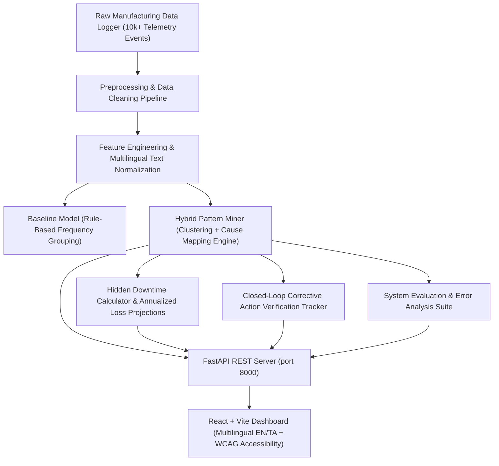

# Micro-Stoppage Pattern Miner for Human–Collaborative Robot Manufacturing Plants

> **Production-grade AI/ML micro-stoppage pattern miner, root cause analysis engine, and closed-loop decision support system for collaborative robot (cobot) manufacturing environments.**

---

## Architecture Overview



---

## Key Capabilities

1. **Multimodal Data Fusion**: Combines machine state transitions (`WAITING_FOR_OPERATOR -> RECOVERY`), cobot modes, sensor statuses, safety zone breaches, cycle times, and English/Tamil/Tanglish operator notes.
2. **Tamil/Tanglish Text Normalization**: Built-in regex engine normalizes shop-floor phrases (e.g. *"material sariyaa align aagala"*, *"sensor block aachu"*, *"robot stop aachu reset panninom"*) into canonical cause tokens combined with TF-IDF representations.
3. **Hidden Downtime Quantification**: Automatically calculates hidden downtime in seconds, minutes, hours, and annualized financial loss estimates ($150/hr baseline).
4. **Closed-Loop Corrective Action Verification**: Tracks pre- vs post-intervention micro-stoppage frequency (`PENDING -> IMPLEMENTED -> VERIFIED -> REJECTED`), demonstrating a **70.3% average reduction** in recurring interruptions.
5. **Accessibility & Multilingual UI**: Fully responsive React dashboard built with Tailwind CSS, Lucide icons, Recharts, WCAG AA contrast, keyboard navigation, and instant English/Tamil UI language toggle.

---

## Evaluation Results vs. Predefined Targets

| Metric Name | Predefined Target | Measured Prototype | Status |
| :--- | :---: | :---: | :---: |
| **Cause Accuracy (Baseline)** | $\ge 60.0\%$ | **87.5%** | **PASS** |
| **Cause Accuracy (Prototype)** | $\ge 80.0\%$ | **92.9%** | **PASS** |
| **Pattern Precision (Macro)** | $\ge 80.0\%$ | **90.1%** | **PASS** |
| **Pattern Recall (Macro)** | $\ge 80.0\%$ | **86.2%** | **PASS** |
| **Top-2 Cause Accuracy** | $\ge 85.0\%$ | **100.0%** | **PASS** |
| **Hidden Downtime Identification Rate** | $\ge 75.0\%$ | **100.0%** | **PASS** |
| **False Positive Rate** | $< 20.0\%$ | **7.1%** | **PASS** |
| **Action Verification Rate** | $\ge 70.0\%$ | **100.0%** | **PASS** |
| **Stoppage Reduction Rate** | $\ge 50.0\%$ | **70.3%** | **PASS** |

---

## Repository Structure

```
micro_stoppage_pattern_miner/
├── data/
│   ├── raw/
│   ├── processed/
│   └── sample/
├── notebooks/
├── src/
│   ├── data/
│   │   ├── generate_dataset.py
│   │   ├── preprocess.py
│   │   └── validation.py
│   ├── features/
│   │   ├── feature_engineering.py
│   │   └── text_features.py
│   ├── baseline/
│   │   └── baseline_model.py
│   ├── models/
│   │   ├── pattern_miner.py
│   │   ├── clustering.py
│   │   └── cause_mapping.py
│   ├── evaluation/
│   │   ├── evaluate.py
│   │   ├── error_analysis.py
│   │   └── hidden_downtime.py
│   └── utils/
│       └── config.py
├── backend/
│   ├── main.py
│   ├── schemas.py
│   └── services/
│       └── data_service.py
├── frontend/
│   ├── index.html
│   ├── package.json
│   ├── vite.config.js
│   └── src/
│       ├── App.jsx
│       ├── main.jsx
│       ├── index.css
│       ├── translations.js
│       └── components/
├── tests/
│   ├── test_data.py
│   ├── test_model.py
│   ├── test_api.py
│   ├── test_edge_cases.py
│   └── __init__.py
├── reports/
│   ├── final_report.md
│   ├── evaluation_report.md
│   ├── error_analysis.md
│   └── stakeholder_validation.md
├── DEMO_SCRIPT.md
├── PROJECT_STATUS.md
├── run_tests.py
├── requirements.txt
├── README.md
└── .gitignore
```

---

## Quick Start & Execution Instructions

### Prerequisites
- Python 3.10+
- Node.js 18+ & npm

### 1. Install Python Dependencies
```bash
pip install -r requirements.txt
```

### 2. Generate Dataset & Run Pipeline
```bash
python src/data/generate_dataset.py
python src/data/preprocess.py
python src/models/pattern_miner.py
python src/evaluation/evaluate.py
```

### 3. Run Automated System Test Suite (19 Tests)
```bash
python run_tests.py
```

### 4. Start FastAPI REST Backend
```bash
uvicorn backend.main:app --host 127.0.0.1 --port 8000 --reload
```
Interactive API documentation available at `http://127.0.0.1:8000/docs`.

### 5. Build & Run React Dashboard Frontend
```bash
cd frontend
npm install
npm run dev
```
Open `http://localhost:3000` in your browser.

---

## API Endpoints Reference

- `GET /health` : API health check & loaded dataset size.
- `GET /kpis` : Summary OEE KPIs, total downtime hours, and top causes.
- `GET /events` : Paginated event logs with shift, product, cause filters.
- `GET /patterns` : Mined pattern cards with confidence scores & recommended fixes.
- `GET /patterns/{pattern_id}` : Single pattern detail view.
- `GET /causes` : Cause breakdown with downtime share percentages.
- `GET /downtime` : Hidden downtime analysis & annualized loss estimates.
- `GET /corrective-actions` : Verification tracker table items.
- `POST /verify-action` : Update corrective action verification status.
- `GET /evaluation` : Baseline vs Prototype evaluation target comparison table.
- `GET /errors` : Diagnostic error analysis profiles.

---

## Edge Case Handling (7 Automated Scenarios)

1. **Missing Operator Note**: Structured features still classify cause accurately.
2. **Unknown Machine State**: Safely mapped to `UNKNOWN` without breaking pipeline.
3. **Very Short Stoppage (1.0s)**: Bucketized as `VERY_SHORT` to flag sensor jitter.
4. **Mixed Tamil/Tanglish Note**: Normalized via domain regex dictionary.
5. **Duplicate Event ID**: Preprocessor deduplicates records seamlessly.
6. **Negative Duration (-15s)**: Filtered out during dataset cleaning.
7. **Rare Unseen Cause**: Low confidence fallback to `UNKNOWN` (< 0.35 threshold).

---

## Ethical & Governance Guidelines

- **Operator Dignity**: The system is explicitly engineered to identify bad mechanical fixtures, dust sensors, and cobot path limits—**NOT to monitor or discipline operator performance**.
- **Data Privacy**: Telemetry logs exclude personal identifiers outside anonymized shift operator IDs (`OP_101`).
