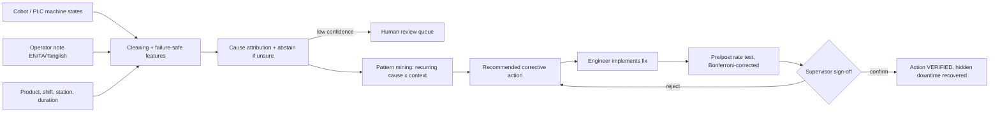

# Users and Workflow Map

| User | Need | What the system gives them |
|---|---|---|
| Cobot operator (Tamil / English) | Log a stop in <10 s without typing a lot | Free-text note in own language; live triage suggests a cause; notes are never used to rank people |
| Line supervisor | See which problems recur on which shift | Pattern cards (cause x station x shift x product) ranked by hidden downtime |
| Maintenance / process engineer | Know what to fix first and whether the fix worked | Recommended action, pre/post rate, 95% CI, VERIFIED / NOT_EFFECTIVE |
| Plant manager | Value of fixing micro-stops | Hidden hours, annualised loss, payback |

**Weekly routine:** Monday: supervisor opens Patterns, picks top card. Engineer implements action. Two weeks later: Corrective-actions tab shows verdict; supervisor confirms or rejects. Friday: review-queue (low-confidence events) and cluster list to find new causes.
