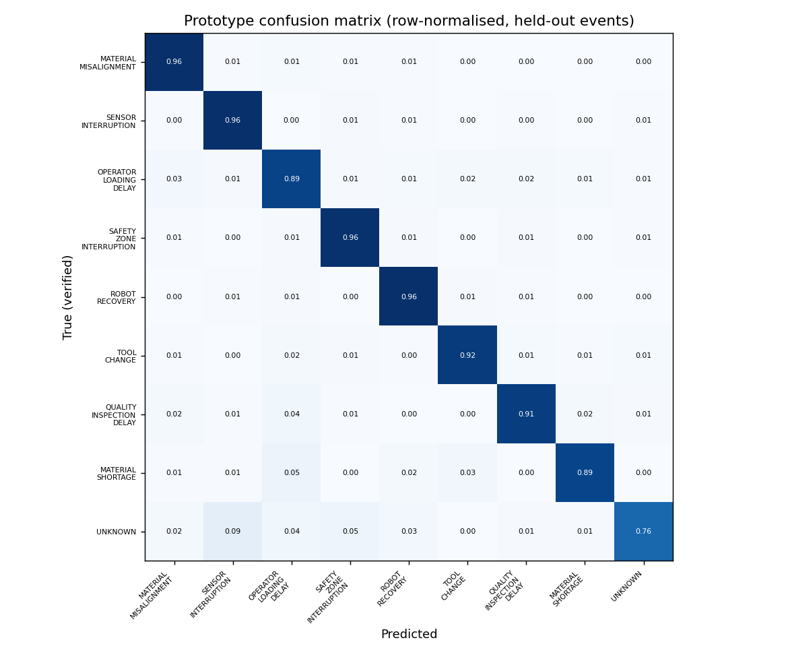
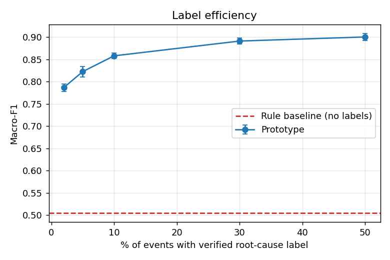
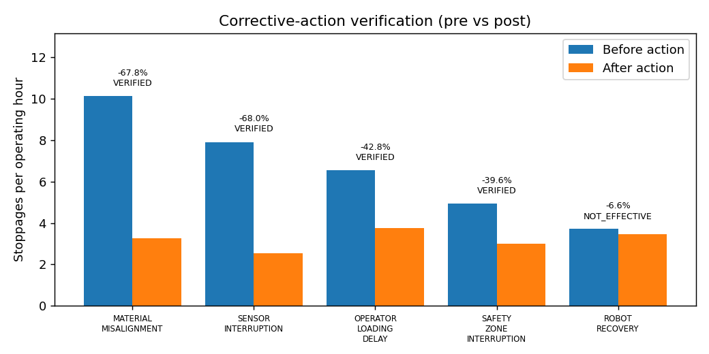
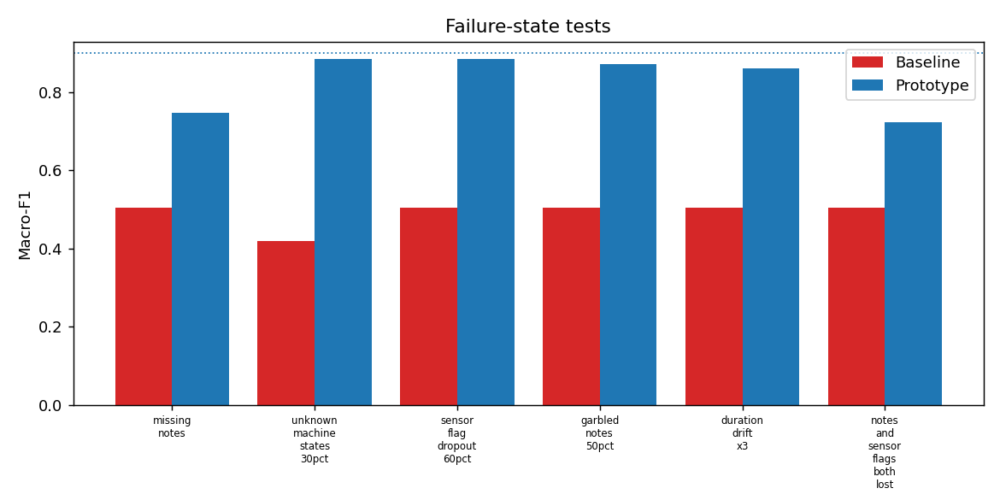

# Evaluation Report (auto-generated by `python -m src.evaluation.evaluate`)

**Data:** synthetic, 10498 cleaned events (6265 before / 4233 after corrective actions went live).
**Protocol:** only 3149 events (30%) carry a maintenance-verified root cause and are used for training; every number below on
classification is measured on the other 7349 held-out events. Targets were fixed before the first run.

## 1. Headline: 7/9 targets met
| Metric | Baseline | Target (set before run) | Measured | Result |
|---|---|---|---|---|
| Prototype macro-F1 (cause attribution) | 0.5044 | >= 0.8 | 0.8985 | PASS |
| Macro-F1 gain over baseline | 0.0 | >= +0.1 | 0.3941 | PASS |
| Hidden downtime attributed to correct cause (share of seconds) | 0.5121 | >= 0.8 | 0.9226 | PASS |
| Top-4 cause downtime attribution error (%) | 23.1 | <= 10.0 | 2.4 | PASS |
| Effective corrective actions correctly VERIFIED (recall) | 1.0 | >= 0.75 | 1.0 | PASS |
| Ineffective action NOT verified | 1.0 | = 1.0 | 1.0 | PASS |
| Mean measured reduction of verified actions | None | >= 0.3 | 0.546 | PASS |
| Worst macro-F1 drop across failure states | 0.0856 | <= 0.15 | 0.1757 | **FAIL** |
| Unseen cause NOT confidently misattributed | 0.0 | >= 0.5 | 0.0181 | **FAIL** |

Two targets fail and are discussed honestly in section 5 and `error_analysis.md`.

## 2. Baseline vs prototype
Baseline = rule lookup on machine_state (+ product for WAITING_FOR_OPERATOR), which is what a plant can build from the MES alone.
Prototype = logistic regression on machine states + product + shift + station + duration + multilingual operator notes.

| | Accuracy | Macro-F1 |
|---|---|---|
| Baseline | 0.5651 | 0.5044 |
| Prototype | 0.9373 | 0.8985 |

Top-2 accuracy of the prototype: 0.9784; abstention rate: 0.0163.

Ablation (macro-F1): structured only 0.7611, text only 0.7284, both 0.8985.
Each signal alone is clearly weaker; the combination is what makes the stoppage causes visible.

### Per-cause results
| Cause | Support | Precision | Recall | Prototype F1 | Baseline F1 |
|---|---|---|---|---|---|
| MATERIAL_MISALIGNMENT | 1685 | 0.964 | 0.96 | 0.962 | 0.557 |
| SENSOR_INTERRUPTION | 1310 | 0.966 | 0.963 | 0.964 | 0.577 |
| OPERATOR_LOADING_DELAY | 1382 | 0.942 | 0.89 | 0.915 | 0.513 |
| SAFETY_ZONE_INTERRUPTION | 1025 | 0.953 | 0.955 | 0.954 | 0.675 |
| ROBOT_RECOVERY | 946 | 0.943 | 0.959 | 0.951 | 0.667 |
| TOOL_CHANGE | 404 | 0.885 | 0.918 | 0.902 | 0.697 |
| QUALITY_INSPECTION_DELAY | 323 | 0.84 | 0.907 | 0.872 | 0.486 |
| MATERIAL_SHORTAGE | 166 | 0.812 | 0.886 | 0.847 | 0.286 |
| UNKNOWN | 108 | 0.683 | 0.759 | 0.719 | 0.081 |

### Label efficiency

| Labeled events | Macro-F1 (mean of 3 seeds) | Std |
|---|---|---|
| 2% | 0.7865 | 0.0084 |
| 5% | 0.8222 | 0.0115 |
| 10% | 0.8577 | 0.006 |
| 30% | 0.8909 | 0.0064 |
| 50% | 0.9001 | 0.0083 |

## 3. Hidden downtime -> verified corrective actions
Hidden downtime = downtime the MES logged only as `UNCLASSIFIED_MICROSTOP`. In the ground truth that is **9210 events / 125.37 h = 87.9%** of all stoppage time over 15.9 days.
Share of hidden-downtime seconds attributed to the correct cause (held-out events): prototype **0.9226** vs baseline **0.5121**.
Downtime attribution error for the top-4 causes: prototype 2.4% vs baseline 23.1%.

Verification rule: events per operating hour before vs after go-live; exact one-sided binomial rate test, Bonferroni-corrected over 8 causes (alpha 0.01/8);
VERIFIED needs reduction >= 30%.

| Cause | Action | n pre | n post | rate/h pre | rate/h post | Reduction (95% CI) | p | Status | Assumed true effect |
|---|---|---|---|---|---|---|---|---|---|
| MATERIAL_MISALIGNMENT | CA-01 | 1703 | 697 | 10.14 | 3.265 | 67.8% [64.8, 70.6] | 1.2e-156 | VERIFIED | 65.0% |
| SENSOR_INTERRUPTION | CA-02 | 1329 | 540 | 7.913 | 2.529 | 68.0% [64.6, 71.1] | 7.8e-124 | VERIFIED | 70.0% |
| OPERATOR_LOADING_DELAY | CA-03 | 1099 | 799 | 6.544 | 3.742 | 42.8% [37.3, 47.9] | 5.5e-34 | VERIFIED | 45.0% |
| SAFETY_ZONE_INTERRUPTION | CA-04 | 829 | 637 | 4.936 | 2.984 | 39.6% [32.9, 45.6] | 4.7e-22 | VERIFIED | 35.0% |
| ROBOT_RECOVERY | CA-05 | 625 | 742 | 3.721 | 3.475 | 6.6% [-4.0, 16.1] | 1.1e-01 | NOT_EFFECTIVE | 3.0% |
| TOOL_CHANGE | CA-06 | 269 | 323 | 1.602 | 1.513 | 5.5% [-11.5, 19.9] | 2.6e-01 | NO_ACTION | 0.0% |
| QUALITY_INSPECTION_DELAY | CA-07 | 201 | 287 | 1.197 | 1.344 | -12.3% [-35.2, 6.5] | 9.1e-01 | NO_ACTION | 0.0% |
| MATERIAL_SHORTAGE | CA-08 | 134 | 118 | 0.798 | 0.553 | 30.7% [10.6, 46.4] | 2.2e-03 | NO_ACTION | 0.0% |

* Effective actions correctly VERIFIED: prototype 1.0, baseline 1.0. **Pass/fail verification alone does not separate the two.**
* The deliberately ineffective action (ROBOT_RECOVERY) was not verified by the prototype (1.0); the baseline's noisy causes reported a 24.8% reduction for it, leaving it INCONCLUSIVE instead of rejected.
* What does separate them is estimate accuracy: mean absolute error vs the simulated true effect is **3.0 pp (prototype) vs 9.3 pp (baseline)**.
* Verified actions recover about 3.865 stoppage-hours per day.
* Important caveat: the "assumed true effect" is chosen by the synthetic generator. The experiment shows the pipeline recovers known effects; it does **not** show that real actions work that well.

## 4. Failure states
| Failure state | Baseline macro-F1 | Prototype macro-F1 | Prototype drop |
|---|---|---|---|
| missing_notes | 0.5044 | 0.7459 | -0.153 |
| unknown_machine_states_30pct | 0.4188 | 0.8846 | -0.014 |
| sensor_flag_dropout_60pct | 0.5044 | 0.8847 | -0.014 |
| garbled_notes_50pct | 0.5044 | 0.87 | -0.029 |
| duration_drift_x3 | 0.5044 | 0.861 | -0.037 |
| notes_and_sensor_flags_both_lost | 0.5044 | 0.7228 | -0.176 |

Unseen cause test (cause `MATERIAL_SHORTAGE` removed from training): only 0.0181 of its events were routed to UNKNOWN; 0.9819 were confidently attributed to a wrong known cause.

## 5. What did not work / iteration log
1. **Run 1** (no augmentation, no multiple-testing correction): macro-F1 0.905; worst failure drop 0.165; duration drift x3 cost 0.159; MATERIAL_SHORTAGE (no action implemented) would have been falsely VERIFIED by chance (30.7% reduction on ~200 events).
2. **Changes made after seeing run 1** (disclosed so the numbers are not read as pre-registered): (a) training-time augmentation (blank notes, dropped status flags, duration jitter); (b) Bonferroni correction for the verification test. Effect: duration-drift drop 0.159 -> 0.0375; false verification removed. Macro-F1 moved 0.905 -> 0.8985.
3. **Still failing:** (a) when notes AND flags are both lost the prototype loses ~0.18 macro-F1; this is information-limited (structured-only ablation = 0.7611) so the dashboard shows lower confidence and routes to review rather than hiding it. (b) A confidence threshold does **not** catch a genuinely new cause. Mitigation is procedural: weekly review of the lowest-margin events and the discovered-cluster list, plus human sign-off before any action is marked verified.

## 6. Robustness across datasets
5 freshly generated datasets (seeds 1-5, `scripts/multi_seed.py`): prototype macro-F1 mean 0.883 (range 0.869-0.891) vs baseline 0.51; hidden-downtime correct share 0.919; false verifications 0.0 in every seed; estimate error 2.1 pp vs 7.44 pp baseline; worst failure drop mean 0.165 (max 0.176, so the <= 0.15 target fails in every seed); unseen-cause abstention mean 0.025.

## 7. Cost vs benefit (assumptions in `reports/cost_benefit_analysis.md`)
Year-1 cost ~$10,360; verified recovery ~1275.4 h/yr ~ $76,525/yr; payback ~1.6 months. Idle energy avoided ~319 kWh (~226 kg CO2): negligible, so the benefit is mainly throughput and operator relief. Dollar figures rest on assumed cost per station-hour and are illustrative.

## 8. Limitations
Synthetic data (generator rules and effect sizes are mine); real notes will be messier; no real operator validation yet; one plant; Tamil/Tanglish lexicon needs native-speaker review.
